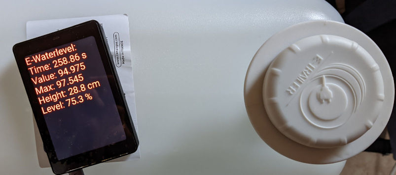

# ESP HOME component for E-Waterlevel by E-Trailer
Read E-Trailer E-Waterlevel directly with ESP Home.

## This is a fork of https://github.com/Fabian-Schmidt/esphome-ewaterlevel. 

The Dev seems inactive and does not respond to issues.
In this fork, I have fixed the issue with compiling.

## 1. Find Sensor

1. Run ESP Home with `ewaterlevel_ble` component.
2. Connect with log and scan for result like `[I][ewaterlevel_ble:058]: E-Waterlevel SENSOR FOUND: AA:BB:CC:DD:EE:FF`.
3. Take note of Sensor Mac address and continue to step 2.

```yaml
external_components:
  - source: github://Fabian-Schmidt/esphome-ewaterlevel
    components: ["ewaterlevel_ble"]

esp32_ble_tracker:
  scan_parameters:
    interval: 10ms
    window: 10ms
    active: false

ewaterlevel_ble:
```

[Full find sensor config](findsensor-console.yaml)

## 2. Calibration

Two options are available:

- Console calibration for any ESP
- Display calibration for an ESP with connected display. (Example is `WT32-SC01`)

### Console calibration

1. Run ESP Home with `ewaterlevel_ble` component and mac address. Take note the component is now a sensor.
2. Connect with log and scan for value like:
   - `[AA:BB:CC:DD:EE:FF] Time: 28.47, Bat: 2.946V, Value: 0.330`
3. Measure 3 points:
   - `min_value` - What value is measured when ~2cm is water is present (the transparent end cap).
   - `max_value` - What value is measured when the tank is full.
   - `length`- If you have cut down the pin enter here the length in cm.
4. Update the value and upload a new version and check that the measurements are correct:
   - `[AA:BB:CC:DD:EE:FF] Waterlevel: 28.7cm, Percentage: 75.1%`

```yaml
external_components:
  - source: github://Fabian-Schmidt/esphome-ewaterlevel
    components: ["ewaterlevel_ble"]

esp32_ble_tracker:
  scan_parameters:
    interval: 10ms
    window: 10ms
    active: false

sensor:
  - platform: ewaterlevel_ble
    mac_address: "AA:BB:CC:DD:EE:FF"
    min_value: 10
    max_value: 125
```

[Full console calibration config](calibrate-console.yaml)

### Display calibration

This example uses an WT32-SC01.

1. Run ESP Home with `ewaterlevel_ble` component and mac address. Take note the component is now a sensor.
2. Measure 3 points:
   - `min_value` - What value is measured when ~2cm is water is present (the transparent end cap).
   - `max_value` - What value is measured when the tank is full.
   - `length`- If you have cut down the pin enter here the length in cm.
4. Update the value and upload a new version and check that the measurements are correct:



[Full display calibration config](calibrate-wt32-sc01.yaml)

## 3. Sensor usage

Run ESP Home with `ewaterlevel_ble` component and mac address and your calibration values (`min_value`, `max_value`, optional `length`).

```yaml
external_components:
  - source: github://Fabian-Schmidt/esphome-ewaterlevel
    components: ["ewaterlevel_ble"]

esp32_ble_tracker:
  scan_parameters:
    interval: 10ms
    window: 10ms
    active: false

sensor:
  - platform: ewaterlevel_ble
    mac_address: "AA:BB:CC:DD:EE:FF"
    min_value: 10
    max_value: 125
    height:
      name: "Water height"
    level:
      name: "Water level"
    battery_voltage:
      name: "Battery Voltage"
    battery_level:
      name: "Battery Level"
```

[Full example config](example.yaml)

Configuration variables:
------------------------

- **mac_address** (**Required**, MAC Address): The MAC address of the E-Waterlevel device.

- **min_value** (*Optional*): Value when tank is empty.

- **max_value** (*Optional*): Value when tank is full.

- **length** (*Optional*): If pin cut down the new length in cm.

- **height** (*Optional*): The raw depth of the liquid for the sensor in cm.

  - All options from [Sensor](https://esphome.io/components/sensor/index.html#config-sensor).

- **level** (*Optional*): The percentage of full for the tank sensor

  - All options from [Sensor](https://esphome.io/components/sensor/index.html#config-sensor).

- **battery_voltage** (*Optional*): The information for the battery voltage sensor.

  - All options from [Sensor](https://esphome.io/components/sensor/index.html#config-sensor).

- **battery_level** (*Optional*): The information for the battery percentage sensor. Sensor uses a standard CR2032 battery.

  - All options from [Sensor](https://esphome.io/components/sensor/index.html#config-sensor).

- **time** (*Optional*): The submitted timestamp from the sensor for diagnostics.

  - All options from [Sensor](https://esphome.io/components/sensor/index.html#config-sensor).

- **value** (*Optional*): The raw measured value from the sensor for calibration or diagnostics.

  - All options from [Sensor](https://esphome.io/components/sensor/index.html#config-sensor).
